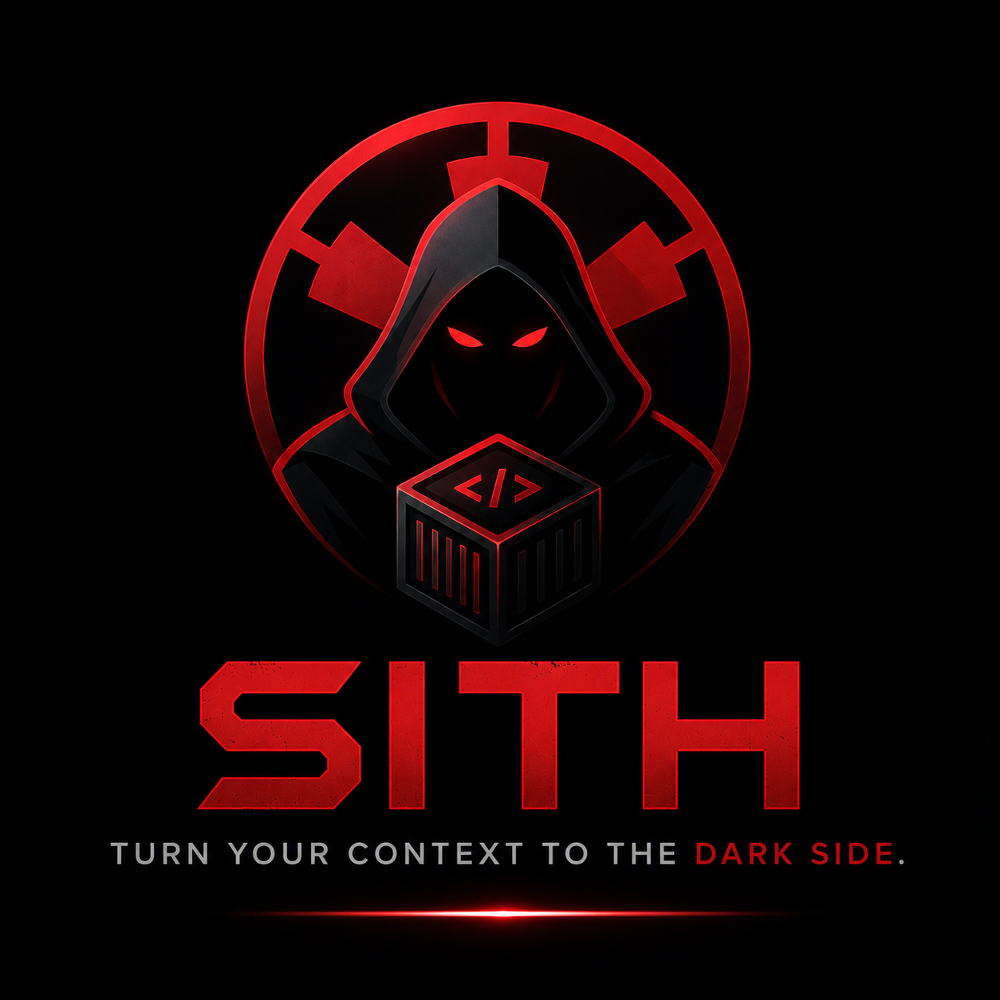

# Sith

<p align="center">
  
</p>

> Turn your context to the dark side.

Standardize and share your OpenCode setup with a fully dockerized environment, designed for seamless collaboration and CI integration.

---

## Quick Start

```bash
npm install -g @m14i/sith   # Install CLI
sith --pull                  # Pull prebuilt Docker image
sith                         # Launch TUI
```

No Docker? Use native Nix:

```bash
sith --nix-install && sith --nix
```

---

## Why?

AI coding tools are powerful in isolation. They become fragile at scale:

- **Context drift** — every developer has a different CLAUDE.md, different tool versions, different configs. The AI sees a different project depending on who's running it.
- **No CI path** — running `opencode` or `claude` in a pipeline requires wiring tokens, installing tools, and hoping the environment matches local.
- **Multiple tools** — Claude Code and OpenCode serve different use cases (Anthropic auth vs GitHub Copilot). Switching between them shouldn't require manual setup.

Sith solves this by packaging both tools, all config, and your team's context into a single Docker image. One pull, same environment, everywhere.

| Problem | Sith answer |
|---------|-------------|
| Inconsistent context across team | Shared `~/.sith/` skills + CLAUDE.md, mounted at runtime |
| AI tools hard to run in CI | Prebuilt signed image + token injection via env vars |
| Claude Code vs OpenCode friction | Both available, same container, same command |
| "Works on my machine" builds | Nix-pinned dependencies inside Docker |

---

## How?

Three modes. Pick based on your trust model, infra constraints, and whether Docker is available. The Docker path is recommended for teams and CI — native Nix is for when you want no container overhead on a machine you control.

| | `sith --pull` | `sith --build` | `sith --nix` |
|---|---|---|---|
| **Setup time** | ~1 min (pull) | ~5–10 min (build) | ~2 min (first run) |
| **Reproducibility** | Pinned image digest | Dockerfile-pinned | Nix-pinned (`nixos-23.11`) |
| **Trust model** | GitHub Actions + Cosign | Your machine only | Your machine only |
| **Signature verification** | ✅ cosign | ❌ | ❌ |
| **SBOM included** | ✅ | ❌ | ❌ |
| **CI/CD ready** | ✅ drop-in | ⚠️ needs build step | ❌ |
| **Requires Docker** | ✅ | ✅ | ❌ |
| **Requires Nix** | ❌ | ❌ | ✅ |
| **Disk usage** | ~2–3 GB (image) | ~2–3 GB (image) | ~500 MB (store) |
| **Works offline** | ✅ after pull | ✅ after build | ⚠️ after store populated |
| **macOS support** | ✅ (amd64 + arm64) | ✅ | ✅ |
| **Linux support** | ✅ | ✅ | ✅ |
| **Windows support** | ✅ Docker Desktop | ✅ Docker Desktop | ❌ |
| **Ideal for** | Teams, CI, daily use | Air-gapped, custom | Local dev, no Docker |

---

## Docker

The recommended path. One image, works locally and in CI.

### Install the CLI

```bash
npm install -g @m14i/sith
```

Or without installing:

```bash
npx @m14i/sith@latest
```

### Get the image

**Prebuilt (recommended) — pull a signed image from GHCR:**

```bash
sith --pull
```

Supports `linux/amd64` and `linux/arm64`. Images are signed with cosign and include an SBOM.

**Verify the signature (optional):**

```bash
cosign verify \
  --certificate-identity-regexp="https://github.com/MerzoukeMansouri/sith" \
  --certificate-oidc-issuer="https://token.actions.githubusercontent.com" \
  ghcr.io/merzoukemansouri/sith:latest
```

**Build from scratch — full control, no external trust:**

```bash
sith --build
```

### Use it

**Interactive TUI** — type a prompt or use slash commands:

```bash
sith
```

| In the TUI | What it does |
|------------|-------------|
| Type any text + Enter | Starts OpenCode with that prompt |
| `/shell` | Drop into Docker shell (no AI) |
| `/claude` | Switch active tool to Claude Code |
| `/opencode` | Switch active tool to OpenCode |
| `/config` | Pull / build options |
| `/help` | Show commands |
| `Ctrl+C` / `Esc` | Exit |

**Direct commands** — skip the TUI:

```bash
sith shell                        # Raw Nix shell inside Docker (alias: sith --it)
sith opencode -p "fix the bug"    # OpenCode starts immediately with your task
sith claude -p "fix the bug"      # Claude Code starts immediately with your task
```

### Cleanup

```bash
sith --docker-cleanup    # Remove sith Docker images (sith:latest + prebuilt GHCR image)
sith --uninstall         # Remove ~/.sith/ (skills, config, nix files)
```

### CI / GitHub Actions

```yaml
- name: Run sith
  env:
    CLAUDE_CODE_OAUTH_TOKEN: ${{ secrets.CLAUDE_CODE_OAUTH_TOKEN }}
    GITHUB_TOKEN: ${{ secrets.GITHUB_TOKEN }}
  run: |
    docker run --rm \
      -e CLAUDE_CODE_OAUTH_TOKEN=$CLAUDE_CODE_OAUTH_TOKEN \
      -e GITHUB_TOKEN=$GITHUB_TOKEN \
      ghcr.io/merzoukemansouri/sith:latest "claude auth status"
```

See [Authentication](./doc/AUTH_CLAUDE.md) for how to generate the tokens.

---

## Direct Nix

No Docker. Runs the same Nix environment natively on your machine.

```bash
sith --nix-install    # Install Nix package manager (once)
sith --nix            # Launch Nix shell directly
```

Or via the `nix` subcommand:

```bash
sith nix --install    # Install Nix
sith nix --shell      # Run Nix shell
```

**Maintenance:**

```bash
sith --nix-update       # Update Nix channels and upgrade installed packages
sith --nix-cleanup      # Remove ~/.sith/nix/ + run nix-collect-garbage -d
sith --nix-uninstall    # Fully remove Nix from system (daemon, /nix/store) — needs sudo
```

See [doc/NIX_INSTALLATION.md](./doc/NIX_INSTALLATION.md) for full setup guide.

---

## Skills

Skills are AI instruction sets installed to `~/.sith/skills/` and automatically mounted into the container at runtime. They shape how Claude Code and OpenCode behave — tone, workflow, shortcuts.

```bash
sith skills    # Browse and install / uninstall skills from catalog
```

Installed skills are synced to `~/.sith/CLAUDE.md` (Claude Code) and `~/.sith/opencode.json` (OpenCode) automatically.

| Skill | What it does | Auto-loaded |
|-------|-------------|-------------|
| `caveman` | Ultra-compressed responses (~75% token reduction) | ✅ |

Skills are loaded from `~/.sith/skills/<name>/` and can be toggled individually. Community skills can be installed from any Git URL.

---

## Authentication

Two AI providers, two token setups:

- **Claude Code** (Anthropic OAuth) → [doc/AUTH_CLAUDE.md](./doc/AUTH_CLAUDE.md)
- **OpenCode** (GitHub Copilot) → [doc/AUTH_OPENCODE.md](./doc/AUTH_OPENCODE.md)

---

## Command Reference

| Command / Flag | Description |
|---|---|
| `sith` | Launch interactive TUI |
| `sith shell` | Raw Nix shell inside Docker |
| `sith opencode -p "<prompt>"` | Launch OpenCode with prompt |
| `sith claude -p "<prompt>"` | Launch Claude Code with prompt |
| `sith skills` | Manage skills from catalog |
| `sith nix --install` | Install Nix package manager |
| `sith nix --shell` | Run Nix shell |
| `sith --pull` | Pull prebuilt Docker image from GHCR |
| `sith --build` | Build Docker image from scratch |
| `sith --it` | Interactive shell in Docker container |
| `sith --nix` | Launch native Nix shell (no Docker) |
| `sith --nix-install` | Install Nix package manager |
| `sith --nix-update` | Update Nix channels + upgrade packages |
| `sith --nix-cleanup` | Remove `~/.sith/nix/` + garbage collect store |
| `sith --nix-uninstall` | Fully remove Nix from system (needs sudo) |
| `sith --docker-cleanup` | Remove sith Docker images from local machine |
| `sith --uninstall` | Remove `~/.sith/` config directory |
| `sith --update` | Check for CLI updates |

---

## Development

```bash
pnpm install       # Install dependencies
pnpm dev           # Run in development mode (no build)
pnpm dev:build     # Build and run CLI
pnpm dev:shell     # Build and launch shell
pnpm typecheck     # Type checking
pnpm clean         # Clean build artifacts
```

---

## Publishing

Automated via semantic-release and conventional commits.

| Prefix | Effect |
|--------|--------|
| `feat:` | Minor version bump |
| `fix:` | Patch version bump |
| `BREAKING CHANGE:` | Major version bump |
| `chore:` `docs:` `style:` | No release |

Push to `main` → GitHub Action bumps version, generates CHANGELOG, publishes to npm.

**Requirements:** `NPM_TOKEN` secret in repository settings.
